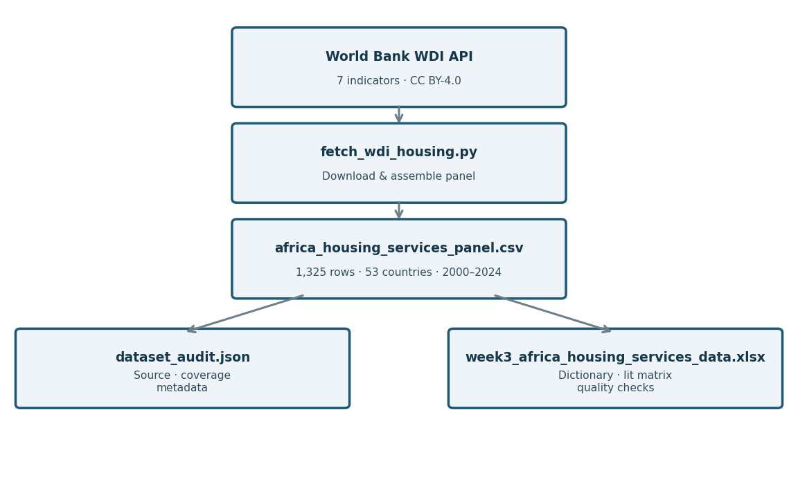
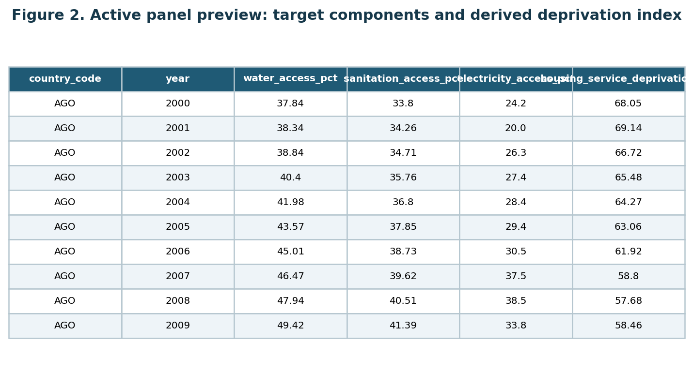

\newpage

# Data Analytics Capstone

## Predicting and Explaining Housing Basic-Services Deprivation Across African Countries Using Public World Bank Indicators, 2000–2024

### Synopsis

Ahmadou Sardaouna  
Walsh College  
QM640: Data Analytics Capstone  
Mentor: Dr. Basu  
Summer 2026 Term  
July 23, 2026

\newpage

# Introduction

## Background and Context

Adequate housing is more than a physical structure; it is the platform through which communities access safe water, sanitation, and electricity—services critical to health, economic participation, and human dignity. Research on South African housing protests documents that the house is experienced as a nexus of water, electricity, sanitation, and safety, and that delivering a structure without resolving service gaps leaves communities substantially deprived (Chiwarawara, 2024). Studies of informal settlements reinforce this point, connecting the absence of basic services to health burdens, flooding risk, fires, and public-service failures (Marutlulle, 2021). These findings matter at a policy level because housing programs can satisfy a construction target while leaving service deprivation entirely unresolved.

For comparative and planning purposes, decision makers across African housing ministries, development-finance institutions, water and sanitation programs, and research organizations need a consistent, reproducible baseline. The World Bank's World Development Indicators (WDI) are the most comprehensive publicly licensed source that covers water, sanitation, and electricity access for all 53 African countries over multiple decades. However, no single publicly documented country-year panel combines these three service-access indicators with the economic and demographic covariates needed to support trend analysis, subregional comparison, and predictive early-warning classification across the full 2000–2024 period. This study constructs, audits, and analyzes such a panel with explicit ecological limitations and country-aware statistical design.

## Problem Statement

African housing and development comparisons typically rely on separate, irregular surveys or single-dimension indicators that are difficult to compare across countries and years. There is no publicly documented, reproducible country-year panel that jointly tracks basic water, sanitation, and electricity access alongside economic and demographic predictors for 53 African countries from 2000 to 2024. Without such a panel, researchers and planners cannot efficiently reproduce a trend analysis, compare subregions, quantify associations with development indicators, or test whether lagged public data can provide an early-warning signal for high-deprivation country-years. This study addresses that gap with a transparent WDI-based service-deprivation index and a country-aware analytic design bounded by explicit ecological inference limitations.

## Purpose of the Study

This study constructs, audits, and analyzes a public African country-year panel of basic housing-service deprivation across four connected purposes: describing temporal trends, estimating associations with economic and demographic predictors, comparing African subregions, and testing whether lagged public indicators can classify one-year-ahead high-deprivation country-years. The study is descriptive, explanatory, comparative, and predictive in a limited early-warning sense; it is not causal, household-level, or an automated eligibility system.

# Literature Review

Research on African housing and service deprivation spans quantitative panel methods, household survey analysis, and qualitative field work. Agbodji et al. (2015) analyze multidimensional deprivation in Burkina Faso and Togo using a composite index that combines housing, utilities, education, employment, and assets, finding that the dimensional contribution to overall deprivation varies significantly by country and gender. Their methodological approach—constructing an equal-weight composite from publicly available indicators—directly informs this study's deprivation index design, though their analysis operates at the household level whereas this study aggregates to country-years. de Milliano and Plavgo (2018) demonstrate that monetary poverty systematically underestimates the breadth of child deprivation in sub-Saharan Africa, reinforcing the need for multidimensional service indicators. Their multi-country panel structure is similar in scope to this project, but they use household survey records rather than national aggregates, a distinction that limits direct comparison while validating the composite approach.

Gradín (2013) traces South African poverty and deprivation to cumulative racial and geographic disadvantages that persist across decades, supporting the use of subregional groupings and country fixed effects in this panel design. His single-country, disaggregated evidence aligns with the subregional hypotheses in RQ3 and the economic associations tested in RQ2. Chiwarawara (2024) and Marutlulle (2021) document through qualitative and policy analysis that housing inadequacy encompasses service gaps that national aggregates obscure, directly motivating the ecological caution applied throughout this study and confirming that a country-year index can serve only as a first-stage screening tool, not a substitute for household-level investigation.

Bouzarovski and Petrova (2015) provide a cross-national energy-deprivation framework that extends beyond electrification rates to include service quality and affordability, noting that aggregate statistics mask within-country inequality—a critique that reinforces this study's composite index approach and its stated limitations. Lin and Okyere (2022) find that energy poverty in South Africa responds to GDP-linked subsidies, consistent with including GDP per capita as a key predictor in RQ2 and suggesting that economic policy variables carry meaningful signal for service-access classification. Yeh et al. (2020) demonstrate that publicly available satellite data combined with machine-learning methods can predict economic well-being proxies in Africa, suggesting that public country-year indicators may likewise carry predictive signal for the RQ4 classification task. Zimmerman et al. (2022) and Kamndaya et al. (2014) confirm that material deprivation co-occurs with health and behavioral outcomes across multiple African contexts, reinforcing the policy relevance of identifying high-deprivation settings early. Across these studies, a shared methodological gap is the absence of a single reproducible, openly licensed country-year panel that combines water, sanitation, electricity, and development predictors for African countries with documented provenance and country-aware validation—the gap this study directly addresses.

# Scope and Objectives

The study covers 53 African countries, calendar years 2000–2024, and seven WDI indicators. The unit of analysis is the country-year. The downloaded panel contains 1,325 rows, of which 1,276 have a complete target value and 1,189 have all planned contemporaneous covariates. After constructing the one-year-ahead classification target, 1,188 complete lagged rows are available. All row counts exceed the planned sample floor of 216. Because 53 countries contribute repeated yearly observations, however, the effective independent sample is far smaller than the row count, and country-aware uncertainty is mandatory throughout.

## Research Question 1 (RQ1)

How did the distribution and trajectory of country-year housing basic-services deprivation change across African countries from 2000 through 2024?

- **$H_{0,1}$:** The mean annual change in the country-level deprivation index is zero.
- **$H_{1,1}$:** The mean annual change in the country-level deprivation index differs from zero.

## Research Question 2 (RQ2)

To what extent are GDP per capita, urbanization, population density, and total population associated with housing basic-services deprivation after accounting for country and year structure?

- **$H_{0,2}$:** The prespecified covariates have no joint association with deprivation after country and year controls.
- **$H_{1,2}$:** The prespecified covariates have a joint association with deprivation after country and year controls.

## Research Question 3 (RQ3)

Do housing basic-services deprivation levels differ across prespecified African subregions after accounting for year?

- **$H_{0,3}$:** Mean deprivation does not differ across subregions after year adjustment.
- **$H_{1,3}$:** At least one subregion has a different mean deprivation level after year adjustment.

## Research Question 4 (RQ4)

Can public economic and demographic indicators measured in year $t$ classify whether a country-year will fall into the high-deprivation category in year $t+1$?

- **$H_{0,4}$:** No prespecified classifier outperforms the majority-class baseline by the minimum practical margin on held-out country-years.
- **$H_{1,4}$:** At least one prespecified classifier outperforms the majority-class baseline by the minimum practical margin on held-out country-years.

## Project Timeline

| Week | Milestone |
|---:|---|
| 1 | Confirm approved problem, scope, target, and open-data route |
| 2 | Acquire WDI indicators and freeze the country/year panel |
| 3 | Audit schema, missingness, duplicate keys, and target arithmetic |
| 4 | Complete literature matrix and finalize data dictionary |
| 5 | Produce RQ1 descriptive trends and component sensitivity summaries |
| 6 | Estimate RQ2 fixed-effects associations with country-aware uncertainty |
| 7 | Add subregion mapping and estimate RQ3 year-adjusted comparisons |
| 8 | Build and evaluate the leakage-controlled RQ4 classification pipeline |
| 9 | Calibration, country-blocked sensitivity, and ethical boundary review |
| 10 | Integrate results, verify reproducibility, and submit final report |

The schedule includes fallback options at every data-dependent step: if a WDI series is revised or incomplete, the frozen audit and complete-case sensitivity analysis remain the primary evidence.

# Sample Size Calculation

For RQ1, a confidence-interval precision calculation uses a planning standard deviation of 10 index points and a two-point margin of error at 95% confidence:

$$n_{RQ1} = \left(\frac{Z_{0.975}\,\sigma}{e}\right)^2 = \left(\frac{1.96 \times 10}{2}\right)^2 = 96.04 \approx 97.$$

For RQ2, the 20-observations-per-predictor rule with five predictors gives 100 rows; a Cohen $f^2=0.15$ cross-check ($n = 9.89/0.15 + 5 + 1 \approx 72$) confirms 100 is the more conservative floor. For RQ3, a five-subregion omnibus comparison at medium Cohen's $f=0.25$, $\alpha=0.05$, and power $=0.80$ requires 196 observations (non-centrality $\lambda = 0.0625 \times 196 = 12.25$, exceeding the 80% threshold at $df_{between}=4$). For RQ4, the balanced two-proportion formula is:

$$n_{RQ4}=\frac{(Z_{\alpha/2}+Z_{\beta})^2 \cdot 2p(1-p)}{\delta^2}=\frac{(1.96+0.84)^2 \times 0.50}{0.15^2}=\frac{7.84 \times 0.50}{0.0225}\approx 175,$$

where $p=0.50$ (balanced-class assumption) and $\delta=0.15$ (minimum meaningful difference over the majority baseline).

| RQ | Method | Key parameters | Min $N$ |
|---|---|---|---:|
| RQ1 | CI precision | $Z=1.96$; $\sigma=10$; $e=2$ | 97 |
| RQ2 | 20-per-predictor rule + Cohen $f^2$ check | 5 predictors; $f^2=0.15$; $\alpha=0.05$; power=0.80 | 100 |
| RQ3 | One-way omnibus | $f=0.25$; $\alpha=0.05$; power=0.80; $\lambda=12.25$ | 196 |
| RQ4 | Two-proportion sensitivity | $\alpha=0.05$; power=0.80; $\delta=0.15$; $p=0.50$ | 175 |

The final planned sample is the maximum: $\max(97, 100, 196, 175) = 196$. Adding a 10% attrition allowance:

$$N_{planned} = 196 \times 1.10 = 216.$$

Available complete-case rows (1,189 contemporaneous; 1,188 lagged) exceed this floor. Because 53 countries contribute repeated observations, the effective independent sample is far smaller: following Gelman and Hill (2007, ch. 20), with an intraclass correlation of approximately 0.60 and 53 countries each contributing approximately 25 years, effective $n \approx 86$. Country-aware uncertainty and chronological validation are structurally required.

# Data Description

## Source and Access

The data come from the World Bank World Development Indicators API (World Bank, 2026):

- Portal: <https://data.worldbank.org/>
- API: `https://api.worldbank.org/v2/country/all/indicator/{CODE}?format=json&per_page=20000`
- License: Creative Commons Attribution 4.0 (CC BY-4.0).
- Acquisition date: July 23, 2026.
- Repository: <https://gitea.plexuserp.com/Plx/PlexusERP> (path `tmp/studies/research/week 3 - synopsis/`).

The frozen panel, audit JSON, acquisition script, workbook builder, and this synopsis are all version-controlled. The reproducible package tree is shown in Figure 1 and reproduced below.

```text
week 3 - synopsis/
├── figures/
│   ├── figure_1_data_pipeline.png
│   └── figure_2_panel_preview.png
└── data/world_bank_africa_housing/
    ├── fetch_wdi_housing.py             ← acquisition script
    ├── build_housing_workbook.py        ← evidence workbook builder
    ├── africa_housing_services_panel.csv    ← frozen panel (1,325 rows)
    ├── dataset_audit.json               ← source + coverage metadata
    ├── README.md
    └── week3_africa_housing_services_data.xlsx
```

{width=85%}

*Figure 1. Data pipeline: World Bank WDI API → acquisition script → frozen CSV panel → audit metadata and evidence workbook.*

## Target Definition

For country $c$ in year $t$, the housing basic-services deprivation index is:

$$D_{c,t}=\frac{(100-W_{c,t})+(100-S_{c,t})+(100-E_{c,t})}{3},$$

where $W$, $S$, and $E$ are the percentages of the population using at least basic drinking-water services (`SH.H2O.BASW.ZS`), basic sanitation services (`SH.STA.BASS.ZS`), and electricity access (`EG.ELC.ACCS.ZS`). The index ranges from 0 (full access) to 100 (complete deprivation). This is a country-year service-access index, not a household multidimensional-poverty measure.

## Data Dictionary

| Variable | WDI code | Unit/encoding | Role | Timing | Missing rule |
|---|---|---|---|---|---|
| `country_code` | Metadata | ISO-3 code | Identifier | Country-year | Required |
| `country_name` | Metadata | Text | Label | Country-year | Required |
| `year` | Observation | Calendar year | Time index | 2000–2024 | Required |
| `water_access_pct` | `SH.H2O.BASW.ZS` | %, 0–100 | Target component | Same year | Required for target |
| `sanitation_access_pct` | `SH.STA.BASS.ZS` | %, 0–100 | Target component | Same year | Required for target |
| `electricity_access_pct` | `EG.ELC.ACCS.ZS` | %, 0–100 | Target component | Same year | Required for target |
| `housing_service_deprivation_pct` | Derived | Index pts, 0–100 | Primary target | Same year | All 3 components required |
| `high_deprivation` | Derived | Binary 0/1 | RQ4 target | One-year-ahead | Threshold learned in training |
| `gdp_per_capita_constant_usd` | `NY.GDP.PCAP.KD` | Const. 2015 USD | Predictor | Prior year (RQ4) | Complete-case |
| `urban_population_pct` | `SP.URB.TOTL.IN.ZS` | %, 0–100 | Predictor | Prior year (RQ4) | Complete-case |
| `population_density` | `EN.POP.DNST` | People/km² | Predictor | Prior year (RQ4) | Complete-case |
| `population_total` | `SP.POP.TOTL` | Persons | Predictor | Prior year (RQ4); log-transform | Complete-case |

{width=90%}

*Figure 2. Panel preview: first 10 rows showing the country-year structure, target components, and the derived deprivation index. The target is deterministically computed from the three access percentages.*

## Data Quality

The panel contains 1,325 rows, 53 countries, years 2000–2024, and zero duplicate country-year keys. The target is complete for 1,276 rows; the complete contemporaneous modeling set contains 1,189 rows. Missingness is managed by documenting complete-case counts, comparing included versus excluded countries, and running sensitivity analyses. A SHA-256 hash of the frozen CSV will be recorded before modeling. No individual-level sensitive attributes are present; country and subregion are used for clustering and comparison, not for individual eligibility decisions.

# Analytic Approach

The analysis proceeds in five stages: (a) freeze and audit the panel; (b) produce descriptive summaries, annual trajectories, and subregional profiles; (c) estimate inferential associations with country and year effects and country-aware uncertainty; (d) construct the leakage-controlled one-year-ahead classification target and evaluate classifiers chronologically; and (e) conduct sensitivity analyses covering threshold choice, component weighting, missingness, and country-coverage. All inferential tests use a two-sided $\alpha = 0.05$ decision rule with 95% confidence intervals. Random row-splitting is prohibited for RQ4; chronological and country-blocked splits are required.

# Solution to RQ1–RQ4

## RQ1: Temporal Trends

RQ1 uses a fixed-effects trend model to separate within-country improvement from cross-country heterogeneity:

$$D_{c,t}=\alpha_c+\gamma_t+\beta\, t+\epsilon_{c,t},$$

where $\alpha_c$ captures country fixed effects, $\gamma_t$ captures common year effects, and $\beta$ summarizes the residual linear time trend. $H_{0,1}$ is rejected when the 95% confidence interval for $\hat{\beta}$ excludes zero. Outputs are an annual trend table, a country-trajectory figure, and a distribution comparison for early versus late years; time is treated as an analytical index, not a cause.

## RQ2: Economic and Demographic Associations

RQ2 uses a prespecified fixed-effects regression:

$$D_{c,t}=\alpha_c+\gamma_t+\beta_1\log(GDP_{c,t})+\beta_2Urban_{c,t}+\beta_3Density_{c,t}+\beta_4\log(Pop_{c,t})+\epsilon_{c,t}.$$

The joint null is tested with a two-sided Wald or partial-$F$ statistic at $\alpha=0.05$. Variance-inflation diagnostics and sensitivity analyses excluding countries with sparse coverage will be reported. All coefficient estimates are associations, not causal effects.

## RQ3: Subregional Differences

Each country is assigned to a prespecified African subregion (Northern, Western, Middle, Eastern, Southern) using a documented mapping stored in the repository. The year-adjusted model is:

$$D_{c,t}=\alpha+\delta_{region(c)}+\gamma_t+\epsilon_{c,t}.$$

The omnibus test is at $\alpha=0.05$. Post-hoc pairwise contrasts apply Tukey's Honest Significant Difference (HSD) when model assumptions hold; otherwise a country-bootstrap procedure resamples countries rather than rows. Regional results reflect country-year service-access patterns, not individual household conditions.

## RQ4: One-Year-Ahead Classification

The binary target is $Y_{c,t+1}=I(D_{c,t+1}\geq\tau_{train})$, where $\tau_{train}$ is the training-fold median. Predictors are from year $t$ only, excluding same-year target components to prevent leakage. Models: majority-class baseline, logistic regression, random forest, and gradient boosting. Primary validation is chronological; a country-blocked sensitivity analysis additionally holds out entire countries.

At the planning minimum $N=175$ with 50% class balance, each class has approximately 87.5 observations and EPV $= 87.5/4 = 21.9$, exceeding the conventional 10-per-variable threshold. Evaluation metrics and formulae:

- **Accuracy:** $(TP+TN)/(TP+TN+FP+FN)$
- **Precision:** $TP/(TP+FP)$
- **Recall (Sensitivity):** $TP/(TP+FN)$
- **Specificity:** $TN/(TN+FP)$
- **F1 score:** $2 \times Precision \times Recall\, /\, (Precision+Recall)$
- **Balanced accuracy (BA):** $(Sensitivity+Specificity)/2$
- **ROC-AUC:** Probability that a randomly drawn positive case scores above a randomly drawn negative case.
- **PR-AUC:** Area under the precision-recall curve; emphasized when class balance may shift.
- **Brier score:** $(1/n)\sum_{i=1}^{n}(p_i-y_i)^2$; lower values indicate better calibration.

A model is considered practically useful only if it improves BA and PR-AUC over the majority baseline with stable chronological performance. Any future operational deployment requires quarterly drift checks, annual recalibration, a documented human override and appeal path, and governance approval.

# Recommendation and Application

The primary users are development-planning analysts, housing and urban-development ministries, water and sanitation programs, electricity-access agencies, regional development banks, and comparative researchers. The recommended application is a two-stage process: first, use the reproducible panel and model outputs to screen for persistent or emerging high deprivation; second, validate any flagged country with current household surveys, administrative records, and local consultations before any policy or funding decision. Results must not be used to rank individual households, deny services, assign blame to a country, or infer individual living conditions from national averages. If RQ4 produces stable predictive performance, a monitored screening dashboard warrants further investigation; if performance is unstable, the negative result is itself useful evidence that public WDI indicators alone are insufficient for early warning without richer local data.

# Limitations and Ethical Boundaries

The principal limitations are: (1) ecological inference—country-year averages cannot establish household relationships; (2) index measurement—the target excludes housing quality, affordability, tenure security, and service reliability; (3) comparability—countries differ in statistical capacity and WDI revision histories; (4) dependence—53 countries' repeated observations make the effective sample far smaller than the row count; and (5) prediction scope—models trained on historical public data may fail under shocks, policy reversals, or measurement revisions. The project mitigates these risks through documented missingness, country-aware uncertainty, chronological validation, and clear separation of exploratory from confirmatory claims. No personal data are used, no individual eligibility is determined, and all outputs are labeled as planning tools requiring human review (Chiwarawara, 2024; Marutlulle, 2021; Zimmerman et al., 2022).

# References

Agbodji, A. E., Batana, Y. M., & Ouédraogo, D. (2015). Gender inequality in multidimensional welfare deprivation in West Africa: The case of Burkina Faso and Togo. *International Journal of Social Economics, 42*(11), 980–1004. https://doi.org/10.1108/IJSE-11-2013-0270

Bouzarovski, S., & Petrova, S. (2015). A global perspective on domestic energy deprivation: Overcoming the energy poverty-fuel poverty binary. *Energy Research & Social Science, 10*, 31–40. https://doi.org/10.1016/j.erss.2015.06.007

Chiwarawara, K. (2024). The struggle for housing and basic services in South Africa: A case for service delivery protests. *Social Dynamics, 50*(2), 148–165. https://doi.org/10.1080/02533952.2024.2352193

de Milliano, M., & Plavgo, I. (2018). Analysing multidimensional child poverty in sub-Saharan Africa. *Child Indicators Research, 11*, 923–945. https://doi.org/10.1007/s12187-017-9488-1

Gelman, A., & Hill, J. (2007). *Data analysis using regression and multilevel/hierarchical models*. Cambridge University Press.

Gradín, C. (2013). Race, poverty and deprivation in South Africa. *Journal of African Economies, 22*(2), 187–238. https://doi.org/10.1093/jae/ejs019

Kamndaya, M., Thomas, L., Vearey, J., Kabiru, C. W., & Kazembe, L. (2014). Material deprivation affects high sexual risk behavior among young people in urban slums, South Africa. *Journal of Urban Health, 91*, 581–594. https://doi.org/10.1007/s11524-013-9856-1

Lin, B., & Okyere, M. A. (2022). Race and energy poverty: The moderating role of subsidies in South Africa. *Energy Economics, 110*, 106464. https://doi.org/10.1016/j.eneco.2022.106464

Marutlulle, N. K. (2021). A critical analysis of housing inadequacy in South Africa and its ramifications. *Africa's Public Service Delivery & Performance Review, 9*(1), a372. https://doi.org/10.4102/apsdpr.v9i1.372

World Bank. (2026). *World Development Indicators*. https://data.worldbank.org/

Yeh, C., Perez, A., Driscoll, A., Athey, S., Bailard, C., Blumenstock, J. E., & Burke, M. (2020). Using publicly available satellite imagery and deep learning to understand economic well-being in Africa. *Nature Communications, 11*, 2583. https://doi.org/10.1038/s41467-020-16185-w

Zimmerman, A., Lund, C., Araya, R., Hessel, P., Sanchez, J., Garman, E., Evans-Lacko, S., Diaz, Y., & Avendano-Pabon, M. (2022). The relationship between multidimensional poverty, income poverty and youth depressive symptoms: Cross-sectional evidence from Mexico, South Africa and Colombia. *BMJ Global Health, 7*(1), e006960. https://doi.org/10.1136/bmjgh-2021-006960

# Appendix A: Complete Data Dictionary

This table is referenced in the Data Description section. It is reproduced here in full so the submission is self-contained without requiring access to the CSV file.

| Variable | Source/code | Unit/encoding | Role | Timing | Missing rule |
|---|---|---|---|---|---|
| `country_code` | World Bank metadata | ISO-3 code | Identifier | Country-year | Required |
| `country_name` | World Bank metadata | Text | Label | Country-year | Required |
| `year` | API observation | Calendar year | Time index | 2000–2024 | Required |
| `water_access_pct` | `SH.H2O.BASW.ZS` | Percent, 0–100 | Target component | Same year | Required for target |
| `sanitation_access_pct` | `SH.STA.BASS.ZS` | Percent, 0–100 | Target component | Same year | Required for target |
| `electricity_access_pct` | `EG.ELC.ACCS.ZS` | Percent, 0–100 | Target component | Same year | Required for target |
| `housing_service_deprivation_pct` | Derived | Index pts, 0–100 | Primary target | Same year | All 3 components required |
| `high_deprivation` | Derived | Binary 0/1 | RQ4 target | One-year-ahead | Threshold learned in training |
| `gdp_per_capita_constant_usd` | `NY.GDP.PCAP.KD` | Const. 2015 USD/person | Predictor | Prior year (RQ4) | Complete-case sensitivity |
| `urban_population_pct` | `SP.URB.TOTL.IN.ZS` | Percent, 0–100 | Predictor | Prior year (RQ4) | Complete-case sensitivity |
| `population_density` | `EN.POP.DNST` | People/km² | Predictor | Prior year (RQ4) | Complete-case sensitivity |
| `population_total` | `SP.POP.TOTL` | Persons | Predictor | Prior year (RQ4); log-transform | Complete-case sensitivity |

# Appendix B: Reproducibility Checklist

Reproducibility specification: Python 3.12; scikit-learn 1.x; pandas 2.x; statsmodels 0.14.x; NumPy 2.x; matplotlib 3.x. Random seed: `6402026`. Frozen CSV SHA-256 hash and pinned environment file will be recorded in the run manifest before any modeling step.

| Requirement | Evidence |
|---|---|
| Title page | Title, student name, Walsh College, QM640, mentor, term, date |
| Introduction + Literature Review | Background, problem, purpose, and comparative synthesis of 10 articles |
| Four RQs + hypotheses | RQ1–RQ4 each with $H_0$ and $H_1$ |
| Sample-size formulae and table | RQ1=97; RQ2=100; RQ3=196; RQ4=175; $N_{planned}=216$ |
| Source URLs + license | WDI portal, API pattern, CC BY-4.0, acquisition date, repository URL |
| Data dictionary | Body table + Appendix A; units, encoding, timing, missingness |
| Open code and data | Frozen CSV, scripts, audit JSON, evidence workbook in repository |
| Figures | Figure 1 (pipeline); Figure 2 (panel preview); both labeled and cited |
| Evaluation metrics with formulae | Accuracy, precision, recall, specificity, F1, BA, ROC-AUC, PR-AUC, Brier |
| Recommendations + governance | Named users, two-stage application, prohibited uses, drift/recalibration |
| References | 12 entries; 10 with DOIs; all citations matched |
